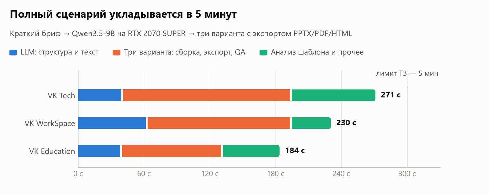
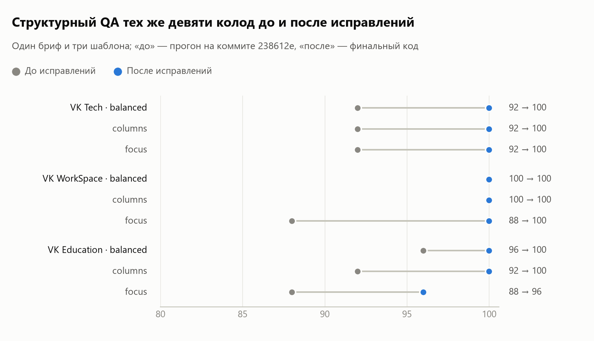
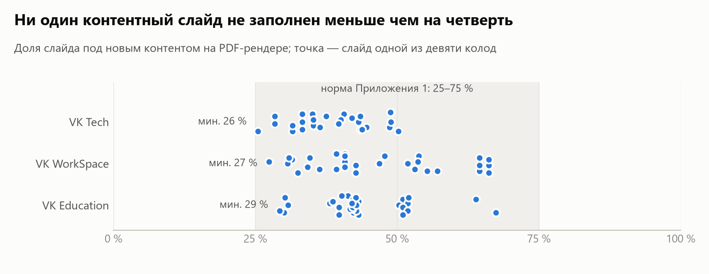

# predel

Веб-сервис презентаций. регистрация требует только имя пользователя, пароль и
должность. Email не нужен. Материалы и результаты изолированы по аккаунтам.

`frontend/` — React + TypeScript + Vite; `backend/` — FastAPI и аккаунты;
`slide_agent/` — движок презентаций.
Подробнее: [frontend](frontend/README.md), [backend](backend/README.md).

```bash
python3 -m venv .venv
source .venv/bin/activate
pip install -e ".[api,dev]"
npm ci --prefix frontend
npm run build --prefix frontend
python -m uvicorn backend.main:app --host 127.0.0.1 --port 8000
```

Откройте `http://127.0.0.1:8000`. Модель подключается существующими переменными
`INFERENCE_*`; без них доступна сборка по полным готовым материалам.
Обучение и формат чекпоинтов не изменены. Для сборки интерфейса нужен Node.js
22.12+ (либо 20.19+); при запуске готовой сборки Node.js не требуется.
Docker собирает интерфейс автоматически отдельным этапом.

Open-source сервис, который анализирует произвольный `.pptx`- или `.pdf`-шаблон и создаёт новую презентацию в его стиле. Система извлекает дизайн-токены и паттерны, планирует структуру через OpenAI-compatible Inference API, выбирает подходящий реальный layout для каждого смыслового блока, собирает PowerPoint и запускает автоматический QA.

Исходные парсер OOXML, промпты и совместимый PPTXGenJS-раннер сохранены; поверх них добавлен автономный Python-сервис, которому не нужны внешние ИИ-агенты или Node.js.

## Результаты

Контрольный прогон 26.09.2026: краткий бриф [`examples/brief_feature.md`](examples/brief_feature.md)
и две картинки → Qwen3.5-9B Q4_K_M (llama.cpp) на RTX 2070 SUPER 8 ГБ → три
предоставленных шаблона VK × три варианта с экспортом PPTX/PDF/HTML. Конфиг —
[`examples/brief_demo.json`](examples/brief_demo.json). **Все девять презентаций
(PPTX и PDF) лежат в [`deliverables/`](deliverables/README.md).** Проверяемые
хэши входов и опубликованных файлов, а также машинные метрики находятся в
[`reports/final-dataset/evidence.json`](reports/final-dataset/evidence.json).
Хэш исходников во время этого прогона — `0fb0a944…`; он отличается от текущего
кода. Условия и пределы воспроизводимости описаны в
[`reports/final-dataset/README.md`](reports/final-dataset/README.md).
Прогон прошёл все строгие критерии конфига: QA `passed` у каждой колоды, не
меньше двух картинок, различимые варианты и не больше 300 с на шаблон.

<picture>
  <source media="(prefers-color-scheme: dark)" srcset="docs/charts/time-dark.png">
  
</picture>

<picture>
  <source media="(prefers-color-scheme: dark)" srcset="docs/charts/qa-dark.png">
  
</picture>

<picture>
  <source media="(prefers-color-scheme: dark)" srcset="docs/charts/fill-dark.png">
  
</picture>

| Шаблон | Весь сценарий, с | LLM, с | QA до → после (balanced / columns / focus) | Картинки | Мин. заполненность |
|---|---:|---:|---|---|---:|
| VK Tech | 271 | 40 | 92 → 100 / 92 → 100 / 92 → 100 | 2 из 2 / 2 из 2 / 2 из 2 | 28 % |
| VK WorkSpace | 230 | 62 | 100 → 100 / 100 → 100 / 88 → 100 | 2 из 2 / 2 из 2 / 2 из 2 | 29 % |
| VK Education | 184 | 39 | 96 → 100 / 92 → 100 / 88 → 100 | 2 из 2 / 2 из 2 / 2 из 2 | 29 % |

- «До» — тот же бриф на коммите `238612e`, но без картинок; модель
  недетерминирована, поэтому это не чистый A/B. Подробности —
  [отчёт о GPU-прогоне](reports/benchmark-2026-09-25/README.md).
- В столбце LLM — построение структуры и текста слайдов; отдельно выполняются
  смысловой аудит и одна перепись отмеченных слайдов (входят во «Весь сценарий»).
- Одна перепись исправила 7, 2 и 2 слайда (VK Tech, VK WorkSpace, VK Education);
  после неё текстовый аудит оставил 3, 2 и 2 подсказки редактору на колоду. Они в
  балл QA не входят и требуют просмотра перед показом.
- В VK WorkSpace все три варианта с первой сборки получили `decor_overlap`:
  схема поперёк кольца или полосы образца, таблица на логотипе. Автоповтор
  сменил макет только у этих слайдов. В VK Tech (`columns`) один полупустой слайд
  один раз пересобран карточками.
- Время VK Tech выше прошлого прогона (176 с) из-за переписи семи слайдов и
  второго прохода рендера; оно зависит от ответа модели и в этом прогоне
  укладывается в лимит с запасом 29 с.
- Контент синтетический, не официальный контент-пакет организаторов. Графики и
  таблицу пересобирает `python examples/readme_charts.py --after <dataset_report.json>`.
- Исходные PPTX организаторов лежат вне Git в `../task+data/Датасет`. Для
  повторного прогона их нужно разместить рядом с клоном и проверить SHA-256 по
  [отчёту](reports/final-dataset/README.md).

## Что уже работает

- Анализ masters, layouts, placeholders, геометрии, шрифтов, цветов, фонов, таблиц и изображений.
- Формирование `design_system.json` и `pattern_catalog.json`, пригодных для повторного использования.
- Контент-планирование через любой OpenAI-compatible `/chat/completions` endpoint.
- Генерация по краткому брифу и назначению (фича, продукт, проект, инициатива):
  модель сначала строит структуру колоды, затем пишет каждый слайд. Ответы
  ограничены JSON-схемой, число слайдов совпадает с запрошенным.
- Детерминированный локальный planner для работы без API и CI-тестов.
- Семантический выбор паттерна под cover, section, content, comparison, data, image и closing.
- Ёмкостный layout mapping по геометрии текста, числу слотов, данным и изображениям с `why_fit`, рисками и альтернативами в `deck_plan.json`.
- Два режима композиции: semantic layouts/exemplars для нормальных PPTX и `native_grid` для PDF-конверсий, где каждый слайд заново собирается из редактируемых объектов по извлечённой сетке.
- Прямой приём PDF в CLI и REST API с фильтрацией служебных масок и ограничением декоративных PDF-фрагментов.
- Удаление уникального исходного контента (скриншотов, клиентских логотипов и фото) с сохранением повторяющегося брендинга и полноэкранных фонов.
- Генерация текста, таблиц, bar/pie charts, metric cards и timeline.
- Нативные схемы в стиле SmartArt (процесс, цикл, иерархия, пирамида, воронка,
  матрица 2×2, сетка пиктограмм) и 135 векторных пиктограмм Lucide в цветах
  шаблона. Без модели схемы выбираются правилами `slide_agent/assets/visual_rules.json`.
- Изображения из загрузок и из материалов (PPTX, DOCX, PDF, Markdown) ставятся
  на подходящие слайды: в фото-слот примера, picture-плейсхолдер или рядом с
  текстом, с кадрированием без искажений. Иначе — векторная иллюстрация по теме.
  Генерация картинок моделью подключается через `IMAGE_*` (см. MODELS).
- Проверка целостности OOXML, числа слайдов, границ элементов, переполнения, пересечений текста и шрифтовой консистентности; в Windows результат дополнительно рендерится настоящим PowerPoint и возвращается в QA-feedback loop.
- CLI, REST API и Docker.
- Асинхронные persistent jobs с загрузкой контентного файла, стадиями, прогрессом и отдельным download endpoint.

## Быстрый старт

### Презентация по краткому брифу (Qwen3.5-9B, GPU или CPU)

Модель — [Qwen3.5-9B](https://huggingface.co/Qwen/Qwen3.5-9B) (Apache 2.0, 9,7B)
в GGUF Q4_K_M, 5,7 ГБ. Один и тот же файл весов работает на видеокарте с 8 ГБ
и на сервере без GPU (нужно около 8 ГБ RAM). Файл, ревизия и SHA-256 закреплены
в [deploy/llama/qwen3.5-9b.json](deploy/llama/qwen3.5-9b.json). Сервер модели —
llama.cpp b11053: CUDA- или CPU-сборка для Windows, Docker-образ собирается из той
же ревизии. Веса в git не хранятся (файл 5,7 ГБ больше лимита GitHub даже для LFS):
`deploy/llama/setup_local.py` скачивает модель в `models/gpu/` и сервер в
`external-fixtures/`, докачивает после обрыва и сверяет SHA-256 каждого файла.

```powershell
# Один раз: веса и llama.cpp (--device cpu без видеокарты)
python deploy/llama/setup_local.py
# Windows, видеокарта (или -Device cpu -Threads 8 без неё)
powershell -File deploy/llama/start-llama.ps1
# Три шаблона × три варианта по брифу; параметры модели — в самом конфиге
python examples/run_dataset.py --config examples/brief_demo.json
```

После прогона `python examples/collect_deliverables.py --report <dataset_report.json>`
копирует колоды в `deliverables/` (без неиспользуемых макетов шаблона), а
`python examples/recheck_plans.py <dataset_report.json> --output <папка>`
пересобирает сохранённые планы без нового вызова модели: так проверяются правки
вёрстки и QA на тех же текстах.

Одна колода из CLI и сервер без GPU:

```powershell
branddeck generate --template brand.pptx --content examples/brief_feature.md `
  --slides 12 --mode brief --purpose feature --export all
docker compose -f compose.llm-cpu.yaml up -d --build
```

`--mode auto` (по умолчанию) включает режим брифа для текста до 1500 знаков
без разделов, если модель подключена; `source` раскладывает готовый материал,
`brief` требует модель. В студии назначение выбирается в поле «Назначение».
Модель использует только факты брифа: числа, которых нет в брифе, аудит
помечает как `number_not_in_source`. Результаты прогона:
[reports/brief-llm-2026-09-23](reports/brief-llm-2026-09-23/README.md).

### VPS 4 ГБ: только веб-сервис

Модель на такой сервер не помещается: Qwen3.5-9B нужно около 8 ГБ RAM. На VPS
работает только веб-сервис из `compose.yaml`, а модель запускается на машине с
видеокартой (`deploy/llama/start-llama.ps1`) или у любого OpenAI-совместимого
провайдера. В `.env` на VPS указывается её адрес; остальные параметры модели —
как в блоке `inference` файла `examples/brief_demo.json`:

```dotenv
INFERENCE_BASE_URL=http://<адрес сервера модели>:8080/v1
INFERENCE_MODEL=qwen3.5-9b
BRANDDECK_CPU_MODE=1
```

`BRANDDECK_CPU_MODE=1` выполняет тяжёлые задачи (анализ шаблона, сборку и
экспорт) по одной, чтобы параллельные запросы не упирались в память сервера.

```bash
docker compose up -d --build
```

`start-llama.ps1` слушает только локальный адрес: до VPS модель доводится через
VPN или SSH-туннель, открывать порт модели в интернет не нужно.

### Локальная установка

Требования: Python 3.10+. Для сборки веб-интерфейса дополнительно Node.js 22.12+.

```powershell
python -m pip install -e ".[api]"
branddeck --json doctor
```

### Веб-интерфейс и три варианта

Для предпросмотра, PDF и HTML установите **LibreOffice** и зависимости экспорта:

```powershell
python -m pip install -e ".[api,export]"
npm ci --prefix frontend
npm run build --prefix frontend
python -m slide_agent serve
```

Откройте **http://127.0.0.1:8000**. Загрузите PPTX, добавьте материалы и создайте
три варианта. Вкладки меняют композицию при одинаковом содержании. Замечания
аудита показаны рядом со слайдами и рамками поверх проблемных блоков.
Выберите доступные исправления: сервис создаст новую версию, изменив макеты
только выбранных слайдов. Замечания, требующие редактуры содержания, отмечаются
отдельно и автоматически не исправляются. Исправленный результат снова проходит QA.

CLI для одного шаблона и всех форматов:

```powershell
python -m slide_agent variants --template "..\task+data\Датасет\VK Tech шаблон.pptx" --content examples/acceptance_content.md --images examples/acceptance_images --slides 10 --offline --export all
```

Изображения для слайдов: `--images папка_или_файлы` (PNG, JPG, WEBP). Картинка
попадает на слайд, чей текст совпадает с её подписью или именем файла; файлы
вроде `IMG_2041.jpg` ставятся по порядку и помечаются в манифесте. В студии
для этого есть кнопка «Добавить изображения». Прогон трёх шаблонов с
картинками и отчёт: [reports/visuals-2026-09-22](reports/visuals-2026-09-22/README.md).

Воспроизводимый прогон **3 шаблона × 3 варианта**:

```powershell
python examples/run_dataset.py --config examples/demo.json
```

Пути в конфиге задаются относительно корня репозитория. По умолчанию используются
три предоставленных PPTX из `../task+data/Датасет`, два изображения и **синтетический**
контент из `examples/acceptance_content.md`.
Официальный контент-пакет организаторов нужно указать в `content`.
Результаты: `slide-workspace/dataset/index.html`, `dataset_report.json`, а также
PPTX/PDF/HTML, изображения и отчёты каждой презентации. Для просмотра тех же
шаблонов в веб-интерфейсе загрузите их в свой аккаунт: CLI-workspace и личные
каталоги пользователей разделены.

PDF и HTML строятся из реального рендера PPTX через LibreOffice. Сам PPTX содержит
редактируемые объекты. HTML — автономный просмотр с SVG-страницами, а не редактор.
Установите шрифты шаблона в системе: при отсутствии шрифта LibreOffice заменит его,
что может изменить переносы строк. Ошибка экспорта и проваленный QA не считаются
успешной задачей; CLI возвращает ненулевой код, API сохраняет статус `failed`.

Ось вариантов — **выбор макетов**: `balanced` выбирает по соответствию содержанию,
`columns` предпочитает несколько текстовых блоков, `focus` — один крупный блок.
Повторение макетов между вариантами мягко штрафуется; текст не переписывается.
Если два варианта почти одинаковы на готовом рендере, сервис один раз пересобирает
часть слайдов одного варианта с другими паттернами того же шаблона и повторяет
пиксельную проверку. Если различия всё ещё малы, отчёт содержит
`diversity_status=needs_review`. Сравнение учитывает изменённые пиксели на
содержательных слайдах.
Разные последовательности макетов сами по себе не доказывают визуальное качество.
Для прогона с локальной Qwen3.5-9B используйте `examples/brief_demo.json`: там
зафиксированы три шаблона, краткий бриф, изображения, параметры инференса,
текстовый смысловой аудит и ограничения приёмки по QA, изображениям и времени.
Текстовый аудит предлагает замечания для редактора; он не проверяет рендеры как VLM.

Документация сдачи: [ARCHITECTURE](ARCHITECTURE.md), [MODELS](MODELS.md), [AUDIT](AUDIT.md).
Проверка браузеров и её ограничения: [отчёт 25.09.2026](reports/browser-2026-09-25/README.md).

Настройте Inference API (названия переменных не привязаны к конкретному провайдеру):

```powershell
$env:INFERENCE_BASE_URL="https://inference.example/v1"
$env:INFERENCE_API_KEY="..."
$env:INFERENCE_MODEL="your-model"
```

Полный pipeline одной командой:

```powershell
branddeck run `
  --template .\templates\brand.pptx `
  --content .\content.md `
  --slides 8 `
  --output .\result.pptx
```

Без LLM, для локальной проверки:

```powershell
branddeck run --template .\brand.pptx --content .\content.md --slides 8 --offline
```

## Отдельные этапы

```powershell
# Один раз разобрать шаблон
branddeck --json analyze .\brand.pptx --name corporate

# Посмотреть доступные template id
branddeck --json templates

# Генерировать сколько угодно презентаций из кэша
branddeck --json generate --template corporate-<hash> --content .\content.md --slides 10

# Повторно проверить готовый файл
branddeck --json inspect .\result.pptx --template .\slide-workspace\templates\corporate-<hash>
```

`--content` принимает inline-текст, Markdown, TXT, JSON, CSV и PPTX. Word/PDF/Excel доступны после установки `pip install -e ".[documents]"`.

## REST API

```powershell
branddeck serve --host 0.0.0.0 --port 8000
```

Swagger UI: `http://localhost:8000/docs`.

Все `/v1/*` требуют сессию. Сначала зарегистрируйтесь или войдите и сохраните cookie:

```bash
curl -c cookies.txt -H 'Content-Type: application/json' \
  -d '{"username":"designer","password":"replace-with-a-strong-password","position":"Дизайнер"}' \
  http://localhost:8000/api/auth/register
```

```bash
curl -b cookies.txt -F "file=@brand.pptx" -F "name=corporate" \
  http://localhost:8000/v1/templates/analyze

curl -b cookies.txt -F "template_id=corporate-<hash>" \
  -F "content=Создай отчёт о результатах квартала..." \
  -F "slide_count=8" \
  http://localhost:8000/v1/presentations/generate

curl -b cookies.txt -o result.pptx \
  http://localhost:8000/v1/presentations/<presentation-id>/download
```

Для долгой генерации и загрузки документа:

```bash
curl -b cookies.txt -F "template_id=corporate-<hash>" \
  -F "content_file=@content.md" \
  -F "slide_count=8" \
  http://localhost:8000/v1/presentations/jobs

curl -b cookies.txt http://localhost:8000/v1/jobs/<job-id>
curl -b cookies.txt -o result.pptx http://localhost:8000/v1/jobs/<job-id>/download
```

Асинхронные записи API сохраняются в `slide-workspace/users/<user-id>/jobs/`. Текущая реализация
исполняет задачи в процессе API; для горизонтального масштабирования потребуется
внешняя очередь.

## Почему решение адаптируется к шаблону

```text
PPTX/PDF template
   ├─ OOXML parser ──> context.json
   ├─ source classifier ──> template_layout | native_grid
   ├─ token/grid extractor ──> design_system.json
   └─ semantic pattern miner ──> pattern_catalog.json
                              │
Content ──> LLM planner ──> capacity-aware pattern scoring
                              │
                              v
       native layouts/exemplars OR rebuilt native composition
                              │
                              v
          output.pptx ──> PowerPoint render ──> QA ──> retry
```

Здесь нет заранее зашитого фирменного шаблона: папка анализа имеет content-addressed id. Для семантического PPTX каждый слайд плана связан с layout/master текущего файла. Если анализатор обнаруживает PDF-фрагментацию, исходные text/vector fragments не клонируются: composer переносит только повторяющиеся брендовые assets и заново строит cover, cards, list, split и closing по извлечённым шрифтам, цветам, полям и сетке.

## Артефакты

Каждая генерация сохраняет `coverage_report.json`: буквальное сопоставление
исходных заголовков/предложений с планом и текстом, таблицами, диаграммами PPTX.
Несопоставленные фрагменты дают предупреждение QA и требуют проверки; перефраз
не считается доказанной потерей смысла. Заметки докладчика не засчитываются
как содержимое слайдов. Это контроль текстового покрытия, не проверка истинности
фактов или видимости текста на рендере.

Offline-планировщик объединяет соседние разделы при ограничении числа слайдов.
Нормализация и повторная попытка больше не обрезают текст/массивы диаграмм.
При недостатке материала для заданного числа слайдов возвращается понятная
ошибка вместо пустых слайдов. Слишком плотный материал сохраняется и проходит
QA; автоматическое смысловое сокращение пока не реализовано.

Каталог анализа версии 1.3 различает полноценные текстовые зоны и короткие
подписи, учитывает слоты картинок и изображения макета. Старый кэш при анализе
исходного файла пересоздается. Прямой выбор по старому template_id требует
повторного анализа исходника. Финальный использованный план записывается в
`deck_plan.final.json`, включая результат повторного выбора макета.

```text
slide-workspace/
  templates/{name}-{sha256[:8]}/
    original.pptx
    source.pdf             # если шаблон был загружен как PDF
    context.json
    extraction.log
    design_system.json
    pattern_catalog.json
    guideline.md
    previews/              # geometry-accurate PNGs for optional VLM analysis
    images/
  presentations/{topic}-{timestamp}/
    source-content.md
    deck_plan.json
    outline.md
    output.pptx
    qa_report.json
    powerpoint-render-N/     # PNG из PowerPoint COM, если доступен
    manifest.json
```

## Demo и тесты

### Baseline на предоставленных шаблонах

Из корня репозитория после установки зависимостей:

```bash
python examples/run_baseline.py
```

По умолчанию скрипт ищет PPTX в родительской папке `vk` и создает по одной
10-слайдовой презентации на одинаковом синтетическом материале
`examples/baseline_content.md`. Это технический offline-прогон, а не проверка
качества LLM или официальный контент-пакет. Параметры `--templates`, `--content`
и `--output` позволяют задать другие пути.

В `slide-workspace/baseline/<UTC-время>/` сохраняются PPTX, подробные отчеты,
`summary.json` и снимок зависимостей. Сводка содержит время, проблемы QA,
статус рендера и контроль неизменности исходников. Структурный QA не заменяет
визуальную приемку; при отсутствии PowerPoint COM рендер отмечен как skipped.
При провале QA скрипт возвращает ненулевой код завершения и сохраняет результаты.

Для ручной визуальной приемки на macOS с установленным PowerPoint:

```bash
osascript examples/export_powerpoint_macos.applescript /absolute/generated.pptx /tmp/new-output.pdf
```

Скрипт экспортирует открытый им файл и закрывает его без сохранения исходного
PPTX. Уже открытая презентация с тем же именем и существующий выходной PDF
отклоняются. Результат нужно проверить на наличие файла и ожидаемого числа
страниц. Это отдельная проверка приемки: Windows COM-аудит в API на macOS
по-прежнему отмечается как `skipped`. Автоматизация PowerPoint может зависать;
для пакетных прогонов задавайте внешний тайм-аут и не считайте отсутствие
PDF успешным экспортом. Для Linux предусмотрен экспорт через LibreOffice;
его необходимо установить в среду, где запускается сборка презентаций.

Создать три разных шаблона (dark tech, editorial, clean blue) и общий набор контента:

```powershell
python .\examples\create_demo_assets.py .\demo-assets
branddeck run --template .\demo-assets\tech-dark.pptx --content .\demo-assets\content.md --slides 7 --offline
```

```powershell
python -m pip install -e ".[dev]"
python -m pytest
```

Для полного набора проверок нужен **LibreOffice**. Тест
`tests/test_delivery.py::test_actual_office_export` действительно преобразует PPTX
в PDF, HTML и PNG-превью, проверяет число страниц и неизменность исходника.
Если LibreOffice отсутствует, только этот тест автоматически пропускается;
`python -m pytest -rs` показывает причину. Для нестандартной установки задайте
`BRANDDECK_LIBREOFFICE` — путь к `soffice.com` на Windows или `soffice` на Linux.
Отдельный запуск: `python -m pytest tests/test_delivery.py::test_actual_office_export -v -rs`.

### Проверка на VK Tech

Текущий основной набор три PPTX из папки `данные`; команда прогона приведена
выше. Дополнительная проверка из предыдущей версии проекта использует публичную
презентацию VK Tech за I квартал 2026 года на 14 страниц. Исходный PDF не включается в git и не переносится в
результат: он используется только для извлечения цветовых ролей, сетки и
повторяющихся композиционных правил.

```powershell
python -m pip install -e ".[dev,pdf-reference]"
$env:BRANDDECK_POWERPOINT_QA="1"

branddeck --workspace .\external-fixtures\vk-tech\q1-2026-workspace run `
  --template .\external-fixtures\vk-tech\VK_Tech_prezentacziya_za_1_Q2026_ae725c0cff.pdf `
  --content .\examples\vk_tech_case_content.md `
  --slides 10 --offline `
  --output .\external-fixtures\vk-tech\generated-vk-tech-q1-2026-native.pptx
```

Результат воспроизводит тёмную обложку, светлые контентные слайды, синюю
акцентную систему, повторяющуюся верхнюю навигацию и split-композицию финала.
Все композиции заново собираются нативными объектами; полноэкранных selectable
pictures в слайдах нет. Публичный синий набор и тёмный спикерский материал
используются только как дополнительные stress-tests.
Источники, хэши, второй прогон и ограничения проверки приведены в
[отчёте VK Tech](docs/vk-tech-validation.md).

## Конфигурация Inference API

| Переменная | Назначение |
|---|---|
| `INFERENCE_BASE_URL` | Base URL, например `https://host/v1`, либо полный URL `/chat/completions` |
| `INFERENCE_API_KEY` | Bearer token; может быть пустым для локального endpoint |
| `INFERENCE_MODEL` | Идентификатор модели |
| `INFERENCE_TIMEOUT` | Таймаут запроса, по умолчанию 120 секунд |
| `INFERENCE_MAX_RETRIES` | Число сетевых попыток, по умолчанию 3 |
| `INFERENCE_VISION` | `1` включает multimodal-анализ PNG-превью, `0` оставляет только JSON |
| `INFERENCE_PARALLEL` | Сколько слайдов брифа писать одновременно; равно `--parallel` сервера llama.cpp (по умолчанию 1) |
| `INFERENCE_EXTRA_BODY` | JSON-объект, добавляемый в каждый запрос, например `{"chat_template_kwargs": {"enable_thinking": false}}` для Qwen3.5 |
| `BRANDDECK_WORKSPACE` | Альтернативная папка артефактов |
| `BRANDDECK_POWERPOINT_QA` | `auto` по умолчанию; `1` требует PowerPoint render-check в Windows, `0` отключает его |
| `IMAGE_BASE_URL`, `IMAGE_MODEL`, `IMAGE_API_KEY` | Необязательный OpenAI-совместимый `/images/generations`; без них картинки не генерируются |
| `IMAGE_MAX_PER_DECK`, `IMAGE_AUTO`, `IMAGE_SIZE` | Лимит генераций (3), генерация для слайдов без визуала (`0`/`1`), размер (`1024x768`) |

Подробности архитектуры и расширения: [docs/architecture.md](docs/architecture.md).
Сравнение с открытыми генераторами и принятые решения: [docs/reference-repo-audit.md](docs/reference-repo-audit.md).

## Ограничения

- **Время.** Лимит ТЗ (5 минут на колоду) подтверждён на GPU: RTX 2070 SUPER 8 ГБ,
  Qwen3.5-9B Q4_K_M в llama.cpp — полный сценарий трёх вариантов с экспортом
  укладывается в пределы из раздела «Результаты». Тот же сценарий на CPU занял
  около 722 с и в лимит не укладывается: без видеокарты модель подходит для
  офлайн-сборки. На VPS 4 ГБ работает только веб-сервис, модель остаётся на
  машине с GPU.
- **Модель.** Проверена локальная Qwen3.5-9B (Apache 2.0). Обязательный для топ-10
  инференс VK с Qwen 27B не запускался: клиент совместим с любым
  OpenAI-совместимым сервером, но время и качество с этой моделью не измерены.
- **Смысловой аудит — текстовый.** Модель проверяет план (неподтверждённые
  утверждения, повторы, заголовки-рубрики) и один раз переписывает отмеченные
  слайды брифа, но рендеры не смотрит. Релевантность картинок, опечатки и логику
  колоды перед показом подтверждает человек (см. [AUDIT](AUDIT.md)).
- **Изображения.** В демо используются загруженные картинки. Генерация картинок
  моделью (`IMAGE_*`) проверена только на тестовом сервере; реальная
  text-to-image модель не запускалась.
- **Контент.** В выданном датасете только три шаблона; все демо-колоды собраны
  по синтетическому брифу `examples/brief_feature.md`, а не по официальному
  контент-пакету.
- **Неизвестные шаблоны.** Проверены два шаблона, которых не было в разработке
  (`mixed.pptx`, quarterly review); на незнакомом шаблоне возможны дефекты
  дизайна, которые структурный QA не видит. QA = 100 означает отсутствие найденных
  дефектов по списку проверок, а не художественную оценку.
- **Схемы.** Схемы в стиле SmartArt — нативные группы фигур, а не объекты OOXML
  SmartArt: LibreOffice показывает SmartArt только из кэша.
- **Браузеры.** Проверены Chrome 153, Firefox и WebKit (Playwright) на Windows
  ([отчёт](reports/browser-2026-09-25/README.md)). Safari на macOS, Яндекс Браузер
  и предыдущие версии браузеров не проверялись.
- **Рендер PowerPoint.** Дополнительная проверка настоящим PowerPoint работает
  только на Windows с установленным Office; иначе используется LibreOffice.
- **Путь с кириллицей.** На Windows с кириллицей в пути к проекту тест
  `test_web_text_cannot_read_server_file` падает: одна сторона сравнения получает
  путь в неверной кодировке. Остальные тесты проходят.


MIT. See [LICENSE](LICENSE).
