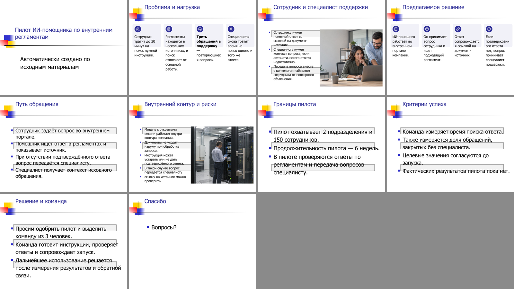
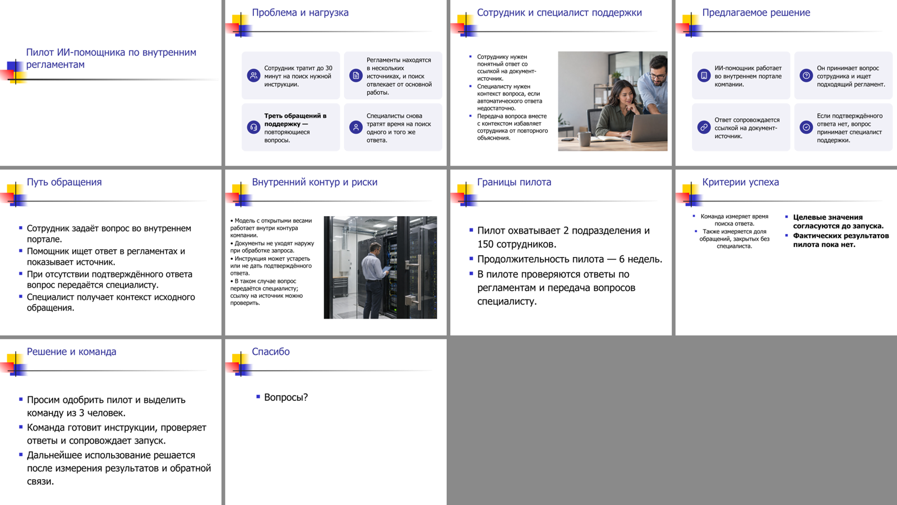
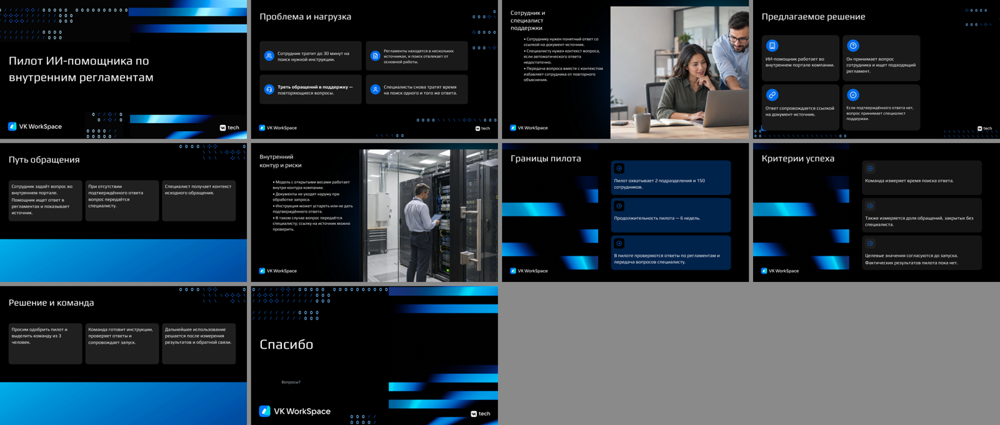
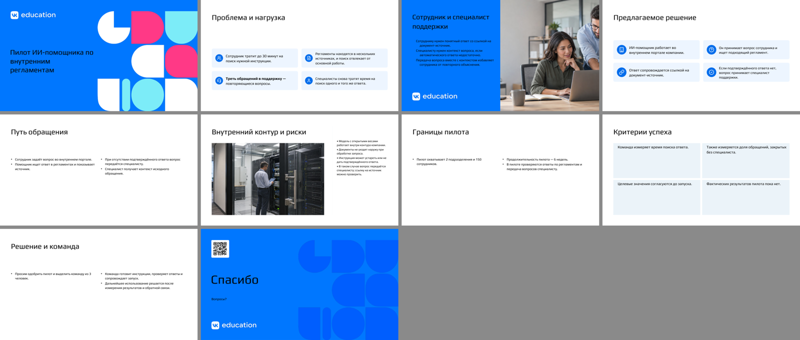

# Остатки образца, картинки в слотах и честный QA — 24.09.2026

Цель: QA не должен ставить 100 слайдам с видимыми дефектами, а сборка не должна
оставлять после слайда-образца пустые карточки, иконки под текстом и рамки без фото.

## Что изменено

| Проблема | Причина | Исправление |
|---|---|---|
| Картинка не попадала в плейсхолдер шаблона (падал `test_picture_placeholder_receives_the_image_or_an_illustration`) | Все слайды с картинкой принудительно собирались на пустом макете | Картинка снова ставится в слот шаблона; макет без слота получает штраф и риск «нет слота изображения» |
| Пустые карточки, «таблетки», QR-рамка, иконки без подписи, серые полосы поперёк пунктов, стрелки поверх текста | После замены текста образца его фигуры оставались на слайде | `_remove_exemplar_leftovers`: удаляются блоки с удалённым образцом текста, прикреплённые к ним иконки и точки, фигуры и линии под новым контентом, пустые рамки под фото. Иконка внутри видимой карточки, несущие панели, полосы на всю ширину и изображения сохраняются. Список удалённого пишется в `exemplar_cleanup` манифеста |
| QA=100 при этих дефектах | Наложение проверялось только между текстами | `template_overlap`, `emptied_template_block`, `empty_photo_frame` со сверкой с `original.pptx`; все три можно выбрать для ремонта, автоматический повтор перебирает макет |
| Полупустые слайды не отражались в оценке | Заполненность не измерялась | `inspect_rendered_fill` на PDF-рендере: меньше ¼ или больше ¾ слайда — предупреждение |
| Бирюзовый основной текст после ремонта контраста | Выбирался ближайший по RGB цвет из всей палитры | Сначала текстовые цвета темы (dk1, lt1, dk2, lt2, чёрный, белый), акцент — только если они не читаются |
| Второй пункт без маркера, со сдвигом | Новые абзацы не наследовали `pPr` первого | Все абзацы повторяют маркер и отступы абзаца образца |
| «Автоматически создано по исходным материалам» на обложке | Служебная подпись офлайн-плана | Подзаголовок обложки пустой (вопрос 7 Приложения 1) |
| «ссылку на источник можно проверить» отдельным пунктом | Разбиение по любой «;» | «;» делит пункты только перед заглавной буквой или цифрой |

## Результаты

Один контент (`examples/acceptance_content.md`, SHA-256 `7c9da4fca6f4…`), 10 слайдов,
две картинки, офлайн-план. Машина разработчика, Windows, LibreOffice.

| Шаблон | Вариант | Статус | QA до → после | Замечания после | Время, с |
|---|---|---|---|---|---|
| VK Tech | balanced | completed | 100* → 84 | 4 × `slide_underfilled` | 23,9 |
| VK Tech | columns | completed | 100* → 84 | 4 × `slide_underfilled` | 39,9 |
| VK Tech | focus | completed | 100* → 84 | 4 × `slide_underfilled` (1-я попытка 56 → повтор 100) | 28,3 |
| VK WorkSpace | balanced | completed | 100* → 100 | — | 37,0 |
| VK WorkSpace | columns | completed | 96* → 100 | — | 30,5 |
| VK WorkSpace | focus | completed | 96* → 100 | `template_bleed` (info) | 39,1 |
| VK Education | balanced | completed | 100* → 88 | 3 × `slide_underfilled` | 31,8 |
| VK Education | columns | completed | 100* → 88 | 3 × `slide_underfilled` | 37,1 |
| VK Education | focus | completed | 100* → 84 | 4 × `slide_underfilled` | 34,6 |

\* Прежний QA не видел дефектов. Новый QA на тех же прежних колодах даёт 4–100:
у VK WorkSpace 20–60 (пустые рамки, наложения, пустые блоки на 6–8 слайдах из 10),
у VK Tech 56–96, у VK Education 80–100.

Три варианта на шаблон: 106,3 / 115,9 / 112,1 с, включая экспорт и проверки рендера.
Все 9 колод разместили обе картинки; варианты различимы (`diversity_status=passed`).

### Отложенный шаблон

`external-fixtures/heldout-2026-09-24/mixed.pptx` (4:3, MIT, SHA-256 `db80910224b0…`,
`examples/run_heldout.py`) раньше в процесс разработки не попадал.

| | До | После |
|---|---|---|
| Статус пакета | failed | completed |
| balanced / columns / focus | failed / failed / failed | 96 / 92 / 100 |
| Время трёх вариантов | 40,5 с | 37,3 с |




### Рендеры (balanced)





## Что осталось

- **Полупустые слайды.** VK Tech (слайды 5, 7–9: список в тёмной панели) и VK Education
  (две колонки с 1–2 пунктами) заняты новым контентом меньше чем на четверть.
  QA это показывает, но сборка пока не подбирает более плотный макет сама:
  проверка заполненности работает после экспорта и не входит в автоматический повтор.
- **Разный кегль в соседних карточках** (VK Tech, columns, слайд 9): каждая карточка
  подгоняет размер отдельно.
- **Стиль колонок образца** на отложенном шаблоне (слайд 8): одна колонка по центру
  и мелко, другая жирная — формат переносится из образца как есть.
- Прогон офлайн, без LLM; смысловой аудит — `not_run`, см. [AUDIT.md](../../AUDIT.md).

## Воспроизведение

```bash
python examples/run_dataset.py --config examples/acceptance_demo.json
python examples/run_heldout.py
python -m pytest
```

Результаты этого отчёта получены в рабочих папках `slide-workspace/p0-final-2026-09-24`
и `slide-workspace/heldout-p0-final` (не входят в репозиторий).
