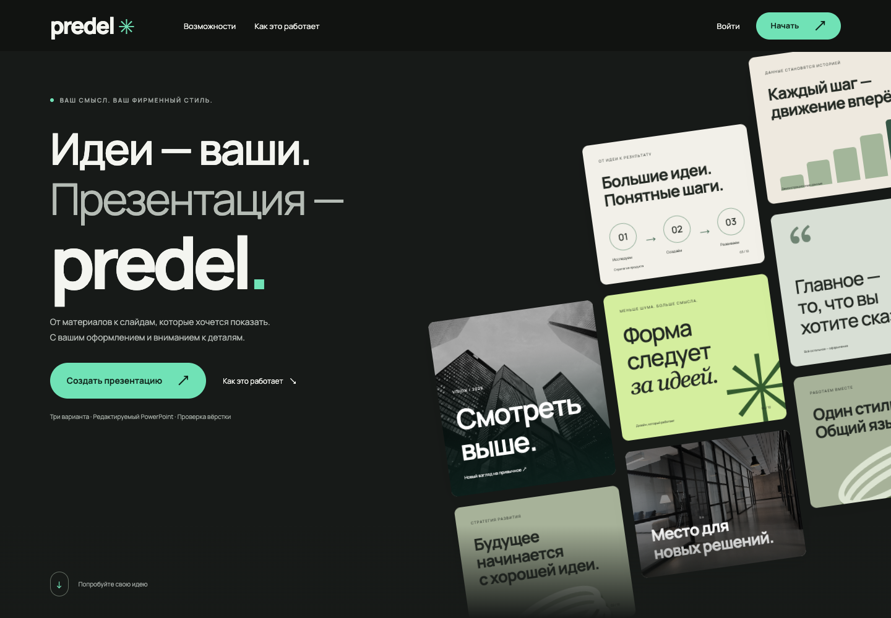
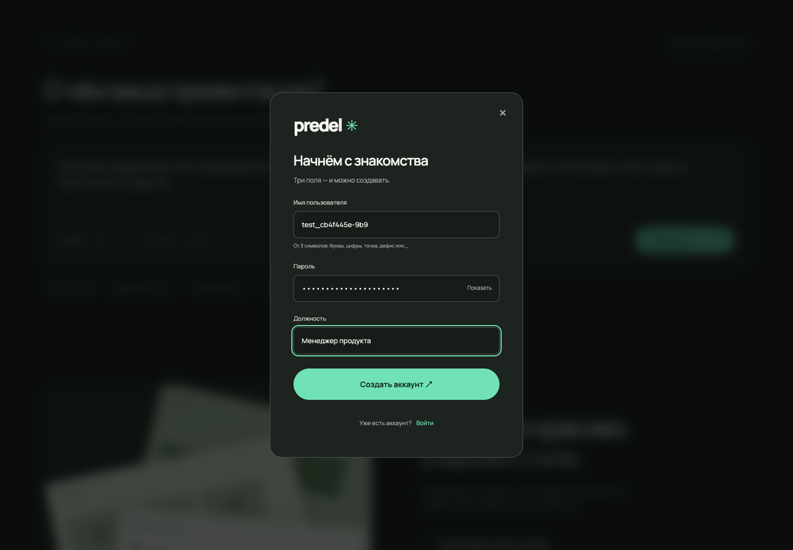
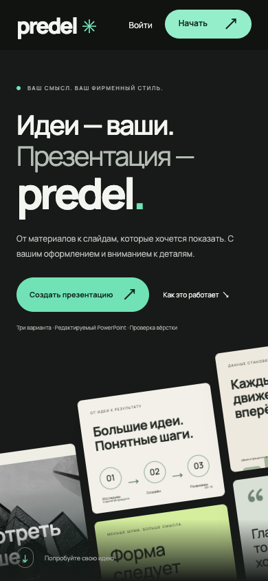

# predel: интерфейс и аккаунты

## Что изменено

- Адаптивная главная с коротким брифом, примерами и описанием трёх шагов.
- Тёмная студия в едином стиле: загрузка шаблона, три варианта, аудит, исправления и скачивание.
- Регистрация: имя пользователя, пароль, должность. Вход, выход и серверные сессии.
- Изоляция шаблонов, заданий и результатов по аккаунтам.
- Верхнеуровневые `frontend/` и `backend/`; движок и обучение остаются отдельно.
- Исправлена обработка повреждённого PPTX: HTTP 400 вместо SystemExit из старого парсера.
- Текст из веб-формы обрабатывается буквально, а не как возможный путь к файлу сервера.

## Проверки

- `python -m pytest`: **71 passed, 1 skipped**.
- Ruff для изменённых Python-модулей, compileall, `git diff --check`, синтаксис JavaScript: пройдены.
- Сборка wheel: frontend, backend, шрифты и изображения входят в пакет.
- Реальный Chrome, 1440×1000 и 390×844: регистрация, перенос брифа, загрузка PPTX,
  три варианта, переключение, скачивание PPTX, восстановление истории,
  выход, неверный пароль и повторный вход. Ошибок JavaScript нет.
- Проверены Escape в модальном окне, reduced-motion и отсутствие горизонтальной
  прокрутки на мобильном экране.

Воспроизводимый браузерный сценарий: `tests/browser_smoke.cjs`.
Аккаунты и документы проверки созданы в отдельном временном workspace.

## Границы проверки

Локально нет LibreOffice: генерация и скачивание PPTX проверены, реальный экспорт
PDF/HTML и превью в этом прогоне недоступны. Интерфейс явно показывает ограничение,
а не подменяет рендер. Dockerfile уже устанавливает LibreOffice.
Модель не подключалась: проверен существующий offline-режим. Обучение и чекпоинты
не изменялись. Замечания QA не считаются успешной проверкой смысла или фактов.

## Вид интерфейса

