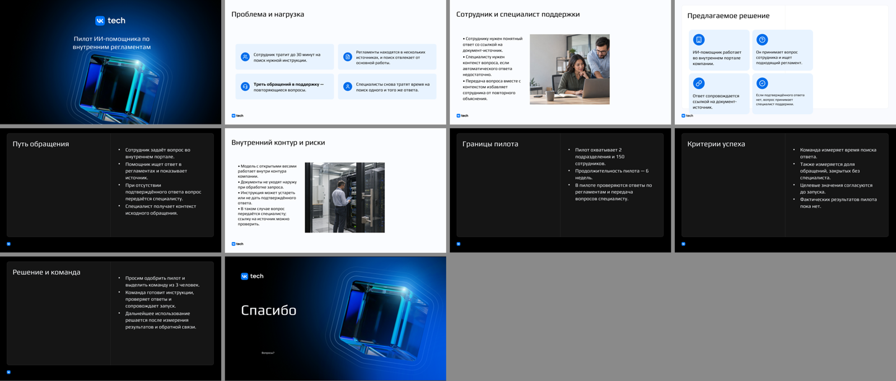
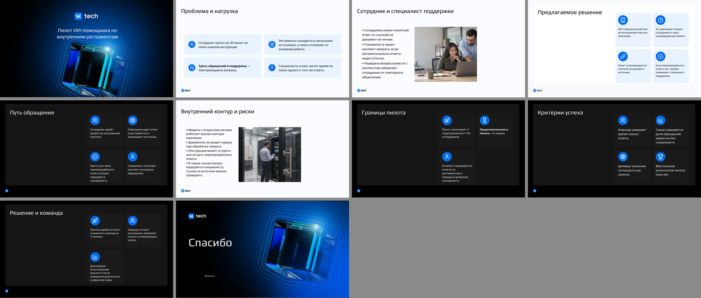
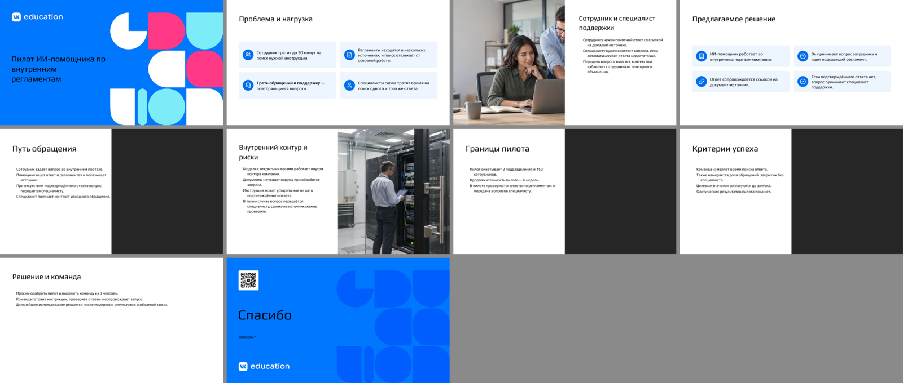
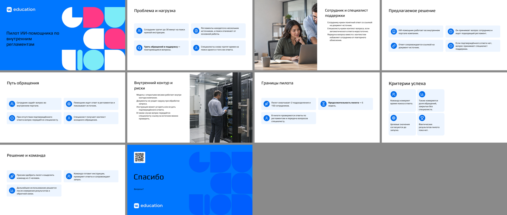
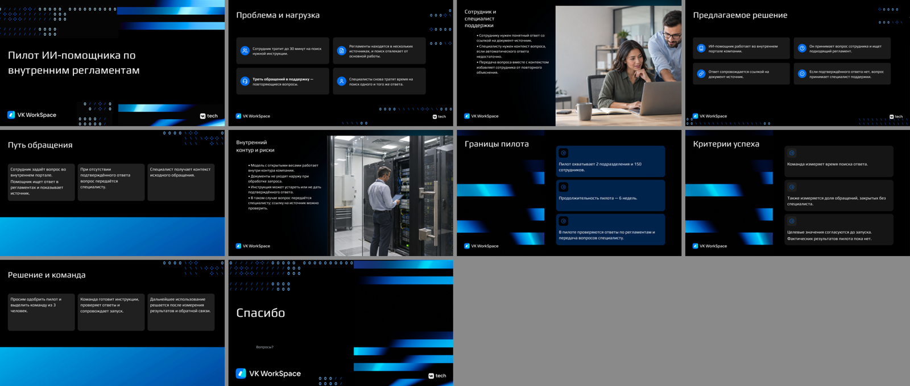
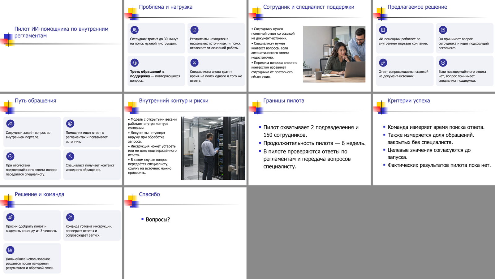

# Полупустые слайды — 24.09.2026

Продолжение [отчёта об остатках образца](../p0-fixes-2026-09-24/README.md). Там QA начал
честно помечать слайды, занятые новым контентом меньше чем на четверть
(Приложение 1). Здесь сборка перестаёт их создавать.

## Почему слайды были пустыми

- Планировщик штрафовал только текст, который не помещается. Большая
  текстовая зона даже получала бонус, поэтому 2–4 коротких тезиса попадали в
  огромные колонки.
- 150–250 знаков в базовом кегле шаблона физически занимают 10–20% слайда:
  одним увеличением шрифта четверть не набрать.
- Макеты «заголовок + объект» и «1 фото» содержат сплошной блок на половину
  слайда. У текстового слайда он оставался пустым цветным полем.

## Что изменено

| Изменение | Где |
|---|---|
| 2–6 коротких тезисов, которые заняли бы меньше четверти слайда и для которых в шаблоне нет видимых карточек, оформляются нативной сеткой карточек в той же зоне (`origin: sparse_text`) | `composer._sparse_statement_cards` |
| Оценка приблизительная, поэтому решает рендер: если после экспорта слайд всё равно меньше четверти, его тезисы один раз пересобираются карточками, и колода проверяется заново (`layout_hint: cards`, `cards_for_underfilled_slides`) | `service._generate_from_plan` |
| Сплошной блок макета под объект (`backdrop_area_ratio`) учитывается анализатором; планировщик не ставит на такой макет контентный слайд. Версия кеша анализа — 1.6 | `analyzer._backdrop_area_ratio`, `planner._score_pattern` |
| Зона схемы: колонка рядом с заголовком (заголовок слева, список справа) теперь считается зоной контента; короткая полоса подписей образца продлевается вниз до конца области контента | `composer._whole_visual_zone` |
| Единый кегль во всех карточках сетки | `diagrams._icon_grid` |
| Если схема несёт весь текст слайда, декор образца в её полосе удаляется (например, график, нарисованный фигурами). Крупная группа с образцом текста считается содержанием, а не панелью; QA проверяет её так же | `composer._remove_exemplar_leftovers`, `layout_geometry.is_framing` |
| Автоповтор QA меняет макет только у слайдов с замечаниями, чтобы три варианта не сходились в один | `service._generate_from_plan` |

## Результаты

Тот же контент (`examples/acceptance_content.md`), 10 слайдов, две картинки, офлайн-план.

| Шаблон | QA до | QA после | Мин. заполненность до → после | Полупустых слайдов до → после |
|---|---|---|---|---|
| VK Tech (balanced / columns / focus) | 84 / 84 / 84 | 100 / 100 / 100 | 0,19 / 0,12 / 0,19 → 0,33 / 0,39 / 0,33 | 4 / 4 / 4 → 0 |
| VK WorkSpace | 100 / 100 / 100 | 100 / 100 / 100 | 0,29 / 0,29 / 0,40 → без изменений | 0 → 0 |
| VK Education | 88 / 88 / 84 | 100 / 100 / 100 | 0,11 / 0,11 / 0,11 → 0,36 / 0,36 / 0,32 | 3 / 3 / 4 → 0 |

Во всех трёх шаблонах варианты различимы (`diversity_status=passed`).
Время трёх вариантов с экспортом и проверками рендера: VK Tech 80 с, VK WorkSpace 114 с,
VK Education 96 с.

Отложенный `mixed.pptx`: все три варианта QA 100, 54 с на три варианта. Второй проход
по рендеру перестроил карточками слайд 8 (balanced) и слайды 5 и 9 (columns).

### До и после








## Ограничения

- Карточки — общий нативный стиль сетки в цветах темы, а не карточки конкретного
  шаблона; на шаблонах с собственными карточками (VK WorkSpace) правило не срабатывает.
- В узкой колонке карточки с длинными тезисами получают кегль до 11 pt.
- Прогон офлайн, без LLM.

## Воспроизведение

```bash
python examples/run_dataset.py --config examples/acceptance_demo.json
python examples/run_heldout.py
python -m pytest
```

Результаты этого отчёта — рабочие папки `slide-workspace/fill-final-2026-09-24` и
`slide-workspace/heldout-fill6` (не входят в репозиторий).
