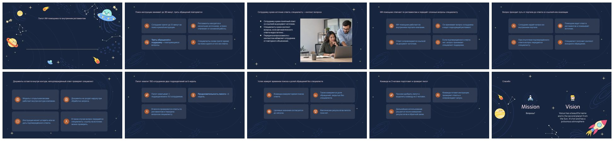
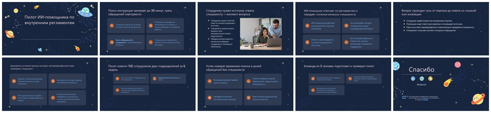
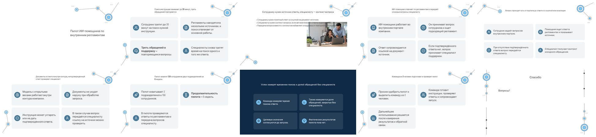
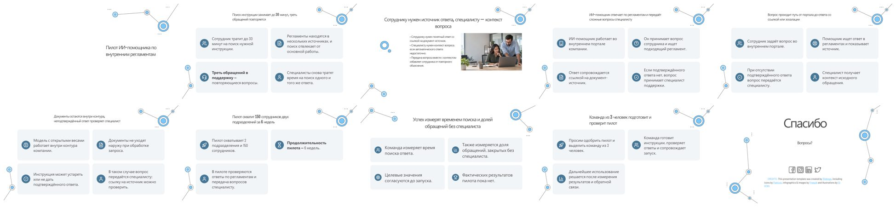
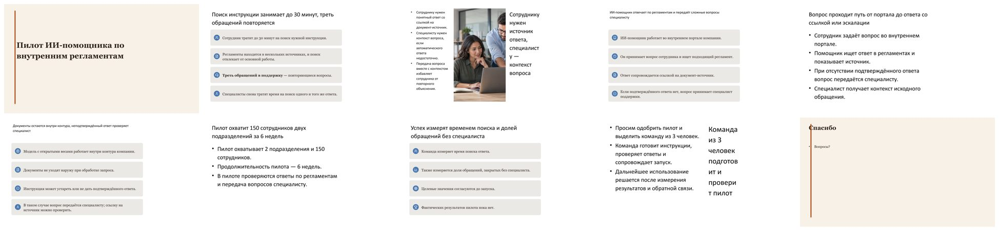
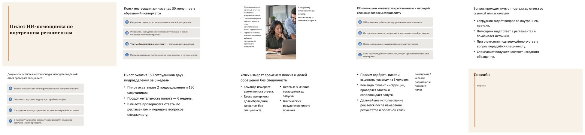

# Проверка на незнакомых шаблонах — 29.09.2026

Цель — критерий ТЗ «решение не заточено под три предоставленных шаблона»: на
финальной защите колоды собираются по шаблону, которого команда не видела. Три
шаблона ниже сервис до этой проверки не анализировал: ни в коде, ни в правилах
нет упоминаний их имён, макетов или цветов.

## Входы

| Шаблон | Источник | SHA-256 | Слайдов |
|---|---|---|---:|
| `tech-consulting.pptx` | «Technology Consulting», Slidesgo (бесплатно, с обязательной атрибуцией) | `f367823f18c42a1a24e8bda1ca9fa3ebb9e76a9837e2a94da79f71d3a7c36587` | 48 |
| `outer-galaxies.pptx` | «Outer Galaxies: Astronomy Education Center», Slidesgo | `ccf78b27c0fac0f956a598635995e33593cef6864f79d67d9a3efeae87fb44f9` | 47 |
| `editorial.pptx` | `python examples/create_demo_assets.py <папка>` (синтетический; хэш зависит от времени создания) | `277e60dea0cbf618b38bb84567d75fd42ab309f78b927ad091034f371d8d62b0` | 3 |

Шаблоны Slidesgo не хранятся в Git (условия Slidesgo не разрешают распространять сами шаблоны);
для повтора их нужно скачать с slidesgo.com и положить в
`external-fixtures/unseen-2026-09-29/`. Контент — синтетический
`examples/acceptance_content.md` и две картинки из `examples/acceptance_images`,
10 слайдов, офлайн-планировщик без модели, экспорт PDF и HTML через LibreOffice
26.8, Windows 11, Intel Core Ultra 5 125H без дискретной видеокарты, PowerPoint
2016 для дополнительного рендер-QA.

```powershell
python examples/run_dataset.py --config examples/unseen_2026_09_29.json
```

## Результат на коде 1.1.0

| Шаблон | Три варианта, с | QA balanced / columns / focus | Различимость (изменённых слайдов в парах) | Картинки | Экспорт PDF/HTML |
|---|---:|---|---|---|---|
| Technology Consulting | 253 | passed 100 / passed 100 / passed 100 | passed (5, 7, 7) | 1 / 1 / 1 | passed / passed / passed |
| Outer Galaxies | 282 | passed 100 / passed 100 / passed 100 | passed (6, 2, 4) | 1 / 1 / 1 | passed / passed / passed |
| Editorial (синтетический) | 55 | passed 100 / passed 100 / passed 100 | passed (8, 6, 6) | 1 / 1 / 1 | passed / passed / passed |

Ревизия `cb2f89e`, код и входы во время прогона не менялись
(`source_unchanged_during_run`, `inputs_unchanged_during_run` — `true`). Прогон
прошёл все строгие критерии конфига: QA `passed` у каждой колоды, хотя бы одна
картинка, различимые варианты, не больше 900 с на три варианта шаблона (лимит ТЗ —
5 минут на одну колоду). Замечания уровня `info`, не снижающие балл: у Tech
Consulting — низкий контраст строки кредитов в макете шаблона, у Outer Galaxies —
декор шаблона, выходящий за край холста (`template_bleed`). Сводка без локальных
путей — [`evidence.json`](evidence.json): хэши шаблонов, итоговых PPTX, конфига и
контента, время, балл и замечания каждой колоды.

## Что нашла проверка на коде 1.0.0

До исправлений все девять колод получали QA = 100, но при просмотре рендеров
были видны дефекты. Каждый теперь исправлен в сборке и ловится отдельной
детерминированной проверкой.

| Дефект на 1.0.0 | Причина | Исправление в 1.1.0 | Проверка |
|---|---|---|---|
| На финальном слайде Outer Galaxies остался текст образца: «Mission», «Vision», «Venus has a beautiful name…» | Образец с тремя заголовками: сборка заполняла первый слот, остальные оставались с текстом образца, а языковая проверка смотрела только сгенерированный текст | Незаполненные слоты образца очищаются; финал распознаётся по слайду «Thanks!» | `template_sample_text` |
| Заголовки контентных слайдов 12 pt при кегле заголовка шаблона 31 pt | Шкала кеглей бралась только из явных размеров на слайдах: у экспорта Google Slides кегль заголовка хранится в плейсхолдере мастера, и шкала была 12/10/8 pt | Кегли плейсхолдеров макетов и мастера входят в шкалу; длинный заголовок получает вторую строку до уменьшения кегля | `font_off_scale` по полной шкале |
| Слайды собраны на служебных страницах шаблона: «Fonts & colors used», «Resources», «Alternative resources» | Анализатор считал любую страницу образцом макета | Инструкции, ресурсы, шрифты и листы иконок не становятся образцами | тест `test_unseen_templates.py` |
| Тезисы уходили под фотографию (Tech Consulting, слайд 3) | Текст образца пересчитывал свою зону и игнорировал зону рядом со слотом картинки | Текст остаётся в зоне рядом со слотом | `image_text_overlap` |
| Заголовок в узкой боковой колонке рвался посреди слова: «специалист / у» (Editorial) | Подгонка кегля учитывала число строк, но не ширину самого длинного слова | Кегль подгоняется и по самому длинному слову | `word_split_risk` |
| Пересборка полупустых слайдов после рендера могла ухудшить колоду (QA 100 → 0) | Второй проход не сравнивался с первым | Если все новые макеты хуже, восстанавливается колода первого прохода | — |

### До и после

Outer Galaxies, вариант balanced: на 1.0.0 (рендер PowerPoint) — заголовки 12 pt и
текст образца на финальном слайде; на 1.1.0 (рендер LibreOffice) — заголовки по шкале
шаблона и финальный слайд «Спасибо».




Tech Consulting, вариант balanced: на 1.0.0 тезисы слайда 3 уходят под фото, финал
собран на макете контентного слайда; на 1.1.0 — текст рядом с фото, финал на слайде «Thanks!»
шаблона.




Editorial, вариант columns: на 1.0.0 заголовок в узкой колонке (слайды 3 и 9)
рвётся посреди слова, а на слайдах 4 и 6 заголовок мельче шкалы шаблона; на 1.1.0 слова целые.




Остальные шесть колод: [Tech Consulting columns](after-tech-consulting-columns.jpg),
[Tech Consulting focus](after-tech-consulting-focus.jpg),
[Outer Galaxies columns](after-outer-galaxies-columns.jpg),
[Outer Galaxies focus](after-outer-galaxies-focus.jpg),
[Editorial balanced](after-editorial-balanced.jpg),
[Editorial focus](after-editorial-focus.jpg).

## Пределы проверки

- Планировщик офлайн: проверяются анализ шаблона, вёрстка, аудит и экспорт, а
  не качество текста модели и не время инференса.
- Время измерено на ноутбуке без GPU и включает три варианта, до трёх
  автоповторов QA на вариант, экспорт LibreOffice и рендер PowerPoint.
- Строка кредитов Slidesgo на финальном слайде — текст макета шаблона, который
  лицензия требует сохранить; её низкий контраст показан как `info`.
- При просмотре осталась мелочь, которую QA не отмечает: на финальном слайде
  Editorial тонкая акцентная полоса макета проходит через первую букву
  «Спасибо» (так же было на 1.0.0).
- Картинка размещена одна на колоду: офлайн-планировщик нашёл по подписи
  подходящий слайд только для одной из двух.
- Это не заменяет слепой прогон организаторов и повтор 3 × 3 по брифу на
  шаблонах VK.
